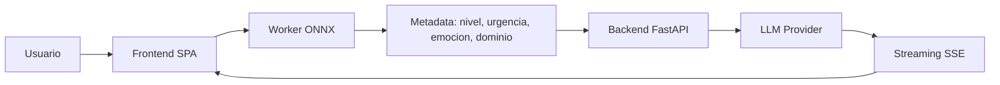
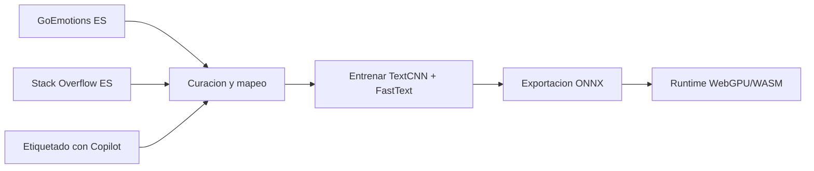

# Synapse

Synapse es una plataforma de tutoría de programación asistida por IA para consultas técnicas en español. Su enfoque combina clasificación contextual con red neuronal y generación de respuestas adaptadas con LLM.

## Contenido

- [Resumen del producto](#resumen-del-producto)
- [Qué hace la aplicación](#qué-hace-la-aplicación)
- [Modelo de clasificación](#modelo-de-clasificación)
- [Datos y entrenamiento](#datos-y-entrenamiento)
- [Arquitectura y operación](#arquitectura-y-operación)
- [API del sistema](#api-del-sistema)
- [Seguridad y privacidad](#seguridad-y-privacidad)
- [Objetivos no funcionales](#objetivos-no-funcionales)
- [Estructura del repositorio](#estructura-del-repositorio)
- [Documentación clave](#documentación-clave)
- [Roadmap](#roadmap)
- [Autores](#autores)

## Resumen del producto

Los asistentes de programación suelen responder sin contexto pedagógico. Synapse introduce una etapa de clasificación previa para adaptar el nivel de detalle, el tono y la estrategia de explicación a cada estudiante.

## Qué hace la aplicación

Flujo end-to-end:

1. El usuario envía una pregunta técnica en español.
2. El clasificador local infiere metadatos contextuales.
3. El backend construye un prompt enriquecido con ese contexto.
4. El LLM responde por streaming en tiempo real.
5. La interfaz muestra respuesta y metadatos de la clasificación.

Resultado esperado: respuestas más útiles para aprendizaje, especialmente en escenarios de bloqueo, confusión o urgencia.



## Modelo de clasificación

Synapse clasifica cada consulta en 4 dimensiones:

- `nivel_tecnico`: `principiante`, `intermedio`, `avanzado`
- `urgencia`: `baja`, `media`, `alta`
- `emocion`: 9 etiquetas pedagógicas (incluye `frustracion`, `confusion`, `ansiedad`, `desesperado`, `neutral`)
- `dominio`: 8 etiquetas del **TextCNN ONNX** actual (`backend`, `frontend`, `bases_de_datos`, `movil`, `devops`, `data_science`, `sistemas_seguridad`, `general`; ver `neural_network/scripts/training_labels.py`)

Estas señales determinan cómo se formula la respuesta: profundidad técnica, tono, estructura y enfoque de resolución.

## Datos y entrenamiento

El proceso documentado de datos/modelado es híbrido:

- GoEmotions ES como base emocional en español.
- Stack Overflow ES como fuente de preguntas reales de programación.
- Etiquetado asistido con Copilot (proxy OpenAI-compatible) para dimensiones faltantes.

Pipeline de entrenamiento:

1. Extracción y normalización de fuentes.
2. Mapeo de etiquetas al esquema Synapse.
3. Curación y balanceo del dataset entrenable.
4. Entrenamiento de **TextCNN** multi-cabeza desde cero (PyTorch) sobre FastText.
5. Exportación a ONNX (`torch.onnx.export`) y ejecución en navegador (WebGPU/WASM).



## Arquitectura y operación

Arquitectura objetivo:

- Frontend SPA (SolidJS + TypeScript).
- Clasificación local en Web Worker con ONNX Runtime Web.
- Backend API (FastAPI) para orquestar prompts, streaming y fallback.
- Proveedor principal LLM + proveedor de respaldo con circuit breaker.

Principio de estado:

- Infraestructura stateless.
- Historial conversacional en memoria de sesión (ventana corta).
- Sin base de datos transaccional para la operación principal.

## API del sistema

Endpoints principales:

- `POST /api/chat`: recibe pregunta + metadatos + historial y responde vía `text/event-stream`.
- `GET /health`: salud operativa para monitoreo.

El contrato de `POST /api/chat` contempla:

- entrada validada (pregunta, metadata, historial),
- tokens SSE para render incremental,
- evento final de uso (proveedor, latencia, tokens),
- errores estandarizados (`400`, `429`, `500`).

## Seguridad y privacidad

Controles clave documentados:

- Secrets solo en backend (`.env` en dev, variables de entorno en deploy).
- CORS restrictivo al origen permitido.
- Rate limiting por IP y límites globales.
- Timeout y circuit breaker para robustez.
- Headers de seguridad (CSP, HSTS, X-Frame-Options, etc.).

Privacidad por diseño:

- Sin cuentas de usuario.
- Sin cookies de tracking.
- Sin persistencia de conversaciones entre sesiones.

## Objetivos no funcionales

Objetivos operativos definidos en requisitos:

- Clasificación local: <100 ms.
- Primer token de respuesta: <2 s.
- Tiempo total de respuesta: <5 s.
- Cobertura de pruebas objetivo: >=80%.
- Operación sobre infraestructura gratuita para contexto académico.

## Estructura del repositorio

Estructura objetivo del monorepo:

```text
synapse/
├── README.md
├── docs/
│   ├── README.md
│   ├── 01-product/
│   ├── 02-architecture/
│   ├── 03-data-and-state/
│   ├── 04-security/
│   ├── 05-project-config/
│   └── 06-roadmap/
├── dataset/
│   ├── README.md
│   ├── raw/
│   ├── processed/
│   ├── final/
│   └── scripts/
├── frontend/
│   ├── src/
│   ├── public/
│   ├── tests/
│   ├── scripts/sync-model-artifacts.mjs
│   ├── vite.config.ts
│   ├── vitest.config.ts
│   ├── playwright.config.ts
│   └── package.json
├── backend/
│   ├── app/
│   └── tests/
└── .github/
    └── workflows/
```

## Documentación clave

- Producto y requisitos: [docs/01-product/requirements.md](docs/01-product/requirements.md)
- Arquitectura general: [docs/02-architecture/overview.md](docs/02-architecture/overview.md)
- Contratos API: [docs/02-architecture/api/contracts.md](docs/02-architecture/api/contracts.md)
- Datos y estado: [docs/03-data-and-state/](docs/03-data-and-state/)
- Seguridad: [docs/04-security/security-model.md](docs/04-security/security-model.md)
- Estructura y frontend: [docs/05-project-config/structure.md](docs/05-project-config/structure.md), [frontend/README.md](frontend/README.md)
- Dataset: [dataset/README.md](dataset/README.md)

## Roadmap

Plan de fases e hitos:

- [docs/06-roadmap/roadmap.md](docs/06-roadmap/roadmap.md)
- [docs/06-roadmap/milestones.md](docs/06-roadmap/milestones.md)

## Autores

- Carlos Alberto Canabal Cordero
- Sebastián José Leal Flórez

Universidad de Córdoba - Simulación
