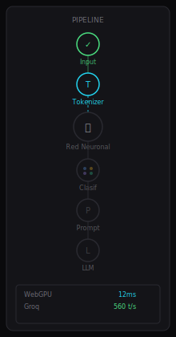
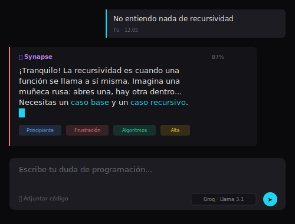
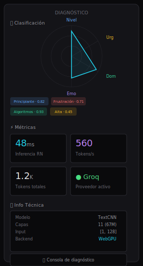

# Diseño de UI — Synapse

Sistema de diseño consolidado. Implementable con SolidUI + Ark UI + Tailwind CSS v4.

---

## 1. Design Tokens (Dark Mode)

### Colores

| Nombre             | Hex       | Rol                                             |
| ------------------ | --------- | ----------------------------------------------- |
| **Deep Void**      | `#0a0a0c` | Fondo base de página                            |
| **Elevated Slate** | `#141418` | Paneles, tarjetas elevadas                      |
| **Surface Ash**    | `#1c1c22` | Inputs, chips, hover states                     |
| **Border Subtle**  | `#292930` | Bordes, separadores                             |
| **Text Primary**   | `#ededef` | Texto principal, headings                       |
| **Text Secondary** | `#9898a0` | Texto secundario, iconos                        |
| **Text Tertiary**  | `#6b6b75` | Placeholders, texto terciario                   |
| **Cyan Accent**    | `#22d3ee` | Input activo, streaming, éxito, pipeline activo |
| **Purple Accent**  | `#c084fc` | Respuestas del tutor, identidad Synapse         |
| **Blue Info**      | `#60a5fa` | Dimensión: nivel técnico                        |
| **Amber Alert**    | `#fbbf24` | Dimensión: urgencia, advertencias               |
| **Violet Emotion** | `#a78bfa` | Dimensión: emoción                              |
| **Emerald Domain** | `#34d399` | Dimensión: dominio                              |
| **Green Success**  | `#4ade80` | Completado, online, éxito                       |
| **Red Critical**   | `#f87171` | Errores, urgencia alta                          |

### Superficies (3 niveles)

| Nivel | Nombre         | Valor     | Uso                                     |
| ----- | -------------- | --------- | --------------------------------------- |
| 0     | Deep Void      | `#0a0a0c` | Fondo de página, chat                   |
| 1     | Elevated Slate | `#141418` | Panel Pipeline, tarjetas diagnóstico    |
| 2     | Surface Ash    | `#1c1c22` | Inputs, chips, hover, tarjetas anidadas |

### Sombras

- **Panel:** `0 2px 8px rgba(0,0,0,0.4), inset 0 0 0 1px rgba(255,255,255,0.06)`
- **Elevated:** `0 4px 16px rgba(0,0,0,0.5), inset 0 0 0 1px rgba(255,255,255,0.08)`
- **Glow Cyan:** `0 0 12px rgba(34,211,238,0.15)`
- **Glow Purple:** `0 0 12px rgba(192,132,252,0.15)`

### Tipografía

| Uso                      | Fuente             | Pesos              |
| ------------------------ | ------------------ | ------------------ |
| UI / Cuerpo / Headings   | **Inter**          | 400, 500, 600, 700 |
| Código / Métricas / Logo | **JetBrains Mono** | 400, 500, 700      |

**Escala tipográfica:** caption 10px, body-sm 12px, body 14px, body-lg 16px, heading-sm 18px, heading 22px, heading-lg 28px, display 36px. Métricas: valor 24px / label 10px. Mono: 11px-13px.

### Espaciado y Forma

- Densidad compacta: gap 8px entre elementos, padding 12px en tarjetas, 16px en paneles
- Border radius: 4px (botones/chips), 8px (tarjetas/paneles), 12px (modales)
- Page max-width: sin límite (app full-viewport, no es landing page)

---

## 2. Layout General (Desktop >=1024px)

Tres paneles horizontales con header superior. Sin SSR, SPA pura.

- **Header (48px):** Logo Synapse a la izquierda. Badge WebGPU + toggle Modo Neurona + toggle dark/light + botón consola a la derecha. Fondo Deep Void, borde inferior sutil.
- **Panel A (260px, colapsable):** Pipeline Visualizer — cascada vertical de 6 nodos conectados por fibras SVG.
- **Panel B (flex-1):** Chat Central — conversación + input al fondo.
- **Panel C (320px, colapsable):** Diagnóstico — radar, métricas, telemetría, historial.

Los paneles A y C se colapsan con botón toggle. Colapsados, el chat ocupa el espacio. Los bordes entre paneles son `Border Subtle` de 1px.

### Wireframes de referencia

> Ver prototipo interactivo completo: [`synapse-desktop.html`](wireframes/synapse-desktop.html) (abrir en navegador, usa Tailwind CDN)

---

## 3. Panel A — Pipeline Visualizer

Cascada vertical de 6 nodos conectados por líneas SVG animadas (fibras). Inspiración: Vercel deploy pipeline, GitHub Actions workflow.

### Nodos

| #   | Nombre        | Ícono             | Tamaño           |
| --- | ------------- | ----------------- | ---------------- |
| 1   | Input         | Texto             | 32px             |
| 2   | Tokenizer     | Fragmentos        | 32px             |
| 3   | Red Neuronal  | Cerebro           | 40px (destacado) |
| 4   | Clasificación | 4 puntos de color | 32px             |
| 5   | Prompt        | Documento         | 32px             |
| 6   | LLM           | Chip              | 32px             |

### Estados de nodos y fibras

- **Reposo:** Nodo opacidad 30%. Fibra opacidad 30%, sólida.
- **Activo:** Nodo opacidad 100%, pulso sutil. Fibra cyan con `stroke-dasharray: 4 4` animado.
- **Completado:** Nodo verde + check. Fibra verde opacidad 60%.
- **Error:** Nodo rojo + icono warning. Fibra roja opacidad 80%.

### Secuencia de activación

Dominó: 1 → 2 → 3 → 4 → 5 → 6 con 150ms de delay entre nodos. El nodo 3 (RN) muestra anillos concéntricos expandiéndose durante la inferencia.

### Info adicional bajo los nodos

- Backend activo: WebGPU con latencia actual
- Proveedor LLM activo: Groq o Gemini con tps
- Botón "Modo Neurona" para expandir a pantalla completa

---

## 4. Panel B — Chat Central

### Burbujas

- **Usuario:** Fondo Surface Ash, borde izquierdo 2px Cyan Accent. Texto Text Primary.
- **Synapse (tutor):** Fondo Elevated Slate, borde izquierdo 2px cuyo color refleja la emoción detectada (rojo=frustración, violeta=curiosidad, etc.). Debajo de cada burbuja, chips colapsables con los 4 scores de clasificación. Al expandir: barra de confianza por dimensión.
- **Streaming:** Cada token aparece con fade-in de 50ms. Cursor parpadeante al final del texto.
- **Código:** Bloques con syntax highlighting (Shiki, lazy-loaded). Botón copiar en cada bloque.
- **Error:** Burbuja con fondo rojo tenue, mensaje de error, botón "Reintentar".

### Prompt Input (inspirado en Cursor)

- Textarea sin bordes visibles. Fondo Surface Ash, border-radius 8px. Altura mínima 44px, crece hasta 200px.
- Placeholder "Escribe tu duda de programación..." en Text Tertiary.
- Al focus: ring cyan sutil (`ring-1 ring-cyan-400/30`).
- Footer del input: barra horizontal con botón adjuntar código a la izquierda, model selector dropdown + botón enviar a la derecha.
- Model selector: dropdown compacto con "Groq · Llama 3.1 8B" y "Gemini · Gemma 4 26B".
- Botón enviar: solo icono (➤). Al hover: glow cyan. Shift+Enter para nueva línea, Enter para enviar.
- **Toggle Groq ↔ Gemini:** Botón "Comparar con Gemini" bajo cada respuesta que regenera con el otro proveedor y muestra ambas.

---

## 5. Panel C — Diagnóstico

Tres secciones verticales, con scroll interno. Componentes: Tabs (Ark UI) para alternar vistas, Accordion para secciones.

### 5.1 Radar de Clasificación

Gráfico radar SVG de 4 ejes (inspirado en Apple Health). El polígono se dibuja vértice por vértice en 400ms. Ejes etiquetados con tipografía mono. Colores de ejes: azul (nivel), ámbar (urgencia), violeta (emoción), verde (dominio). Debajo, 4 chips horizontales con color + score. La dimensión dominante tiene borde sutil glow. Al hover en cada chip, tooltip con explicación.

### 5.2 Métricas en Vivo

Grid 2x2 de tarjetas compactas (inspirado en Vercel Analytics). Cada tarjeta: valor grande (24px JetBrains Mono), label pequeño (10px Inter Medium), sparkline SVG minimalista.

| Tarjeta        | Valor ejemplo | Sparkline        |
| -------------- | ------------- | ---------------- |
| Inferencia RN  | 48ms          | última latencia  |
| Tokens/s LLM   | 560           | velocidad stream |
| Tokens totales | 1.2K          | acumulados       |
| Proveedor      | Groq / Gemini | badge            |

### 5.3 Telemetría Técnica

Sección Accordion expandible con tabs internos: "RN" y "LLM".

**Tab RN (ONNX + WebGPU):**

| Métrica      | Valor                                           |
| ------------ | ----------------------------------------------- |
| Modelo       | TextCNN + FastText (entrenada desde cero)       |
| Parámetros   | ~0.3–2M entrenables (embed congelado al inicio) |
| Input shape  | `[1, 96]` int64 (`input_ids`)                   |
| Output shape | 4× logits `[1,3]`, `[1,3]`, `[1,9]`, `[1,11]`   |
| Precisión    | FP32 (INT8 opcional)                            |
| Tamaño       | típ. < 15 MB ONNX FP32                          |
| Backend      | WebGPU / WASM                                   |
| VRAM         | ~45MB                                           |

**Tab LLM:**

| Métrica      | Groq (Llama 3.1 8B)    | Gemini (Gemma 4 26B A4B) |
| ------------ | ---------------------- | ------------------------ |
| Modelo ID    | `llama-3.1-8b-instant` | `gemma-4-26b-a4b-it`     |
| Parámetros   | 8B                     | 26B (3.8B activos MoE)   |
| Contexto máx | 131K                   | 262K                     |
| Temperature  | 0.7                    | 0.7                      |
| Top P        | 0.95                   | 0.95                     |
| Max output   | 2048                   | 2048                     |
| Velocidad    | ~560 tps               | ~300-500 tps             |
| Costo        | $0.05/$0.08            | $0.06/$0.30              |

**Prompt Enriquecido:** Panel expandible que muestra el prompt real enviado al LLM (System, Metadata, Instrucción de tono, Historial, Pregunta). Sin formato de código, en texto plano legible. Transparencia total.

### 5.4 Historial de Sesión

Lista vertical de chips clickeables con las últimas clasificaciones. Cada chip: timestamp + dominio + emoción (emoji). Al hacer click, el chat hace scroll a esa pregunta y el pipeline muestra los metadatos de ese momento.

### 5.5 Consola de Diagnóstico

Panel tipo DevTools (inspirado en Arc Browser). Fondo Surface Ash, tipografía JetBrains Mono 11px. Logs en tiempo real con colores: cyan (info), amber (warn), green (success), red (error). Auto-scroll. Botón toggle en el header para abrir/cerrar.

---

## 6. Animaciones y Micro-interacciones

Todas con CSS/Tailwind, sin librerías externas. Principio: nada es instantáneo, todo tiene transición de 150-300ms con ease-out.

| Interacción          | Efecto                                      | Duración |
| -------------------- | ------------------------------------------- | -------- |
| Enviar pregunta      | Texto se difumina en input, aparece en chat | 200ms    |
| Nodo pipeline activo | Pulso sutil, fibra entrante animada         | Loop     |
| Token streaming      | Fade-in + translateY(2px)                   | 50ms     |
| Radar clasificación  | Polígono dibujado vértice a vértice         | 400ms    |
| Hover en chip        | Elevación 2px, tooltip                      | 150ms    |
| Hover en panel       | Borde ilumina al 20%                        | 150ms    |
| Colapsar panel       | Transición de width                         | 300ms    |
| Modo Neurona         | Panel A expande de 260px a 100vw            | 400ms    |
| Scroll chat          | Mensajes antiguos reducen opacidad          | Gradual  |

### Animaciones de nodos del pipeline

- **Input activo:** Fade-in del texto en el chat
- **Tokenizer activo:** 2-3 partículas dots flotando hacia arriba
- **RN activo:** 3 anillos concéntricos expandiéndose (scale + opacity)
- **Clasif activo:** 4 puntos de colores apareciendo con delay 50ms cada uno
- **Prompt activo:** Ícono de documento con scaleY animado
- **LLM activo:** Pulso + partículas fluyendo hacia el panel de chat

---

## 7. Modo Neurona (Toggle en Header)

Al activar: Panel A se expande a pantalla completa. El nodo RN muestra 3-4 anillos concéntricos etiquetados ("Embedding", "Hidden 1", "Hidden 2", "Output"). Los nodos en cada anillo se iluminan secuencialmente simulando potencial de acción. Muestra dimensiones de tensores: `[1,128] → [1,64] → [1,32] → [1,11]`. Overlay con datos del modelo. Ideal para sustentación: demuestra que la RN real corre en el navegador.

---

## 8. Elementos WOW para Sustentación

1. **Modo Neurona:** RN fullscreen con activación de capas visible
2. **Badge WebGPU en header:** `⚡ WebGPU · ONNX · 0ms al servidor`. Click → expande diagrama de arquitectura con latencias reales
3. **Toggle Groq ↔ Gemini:** Comparar respuestas de ambos LLMs lado a lado
4. **Consola de diagnóstico:** Logs en tiempo real del pipeline: `[RN] Input: [1,128] → {nivel_tecnico: 0.82, urgencia: 0.45, ...}`
5. **Prompt enriquecido visible:** Muestra el prompt real que recibe el LLM — transparencia total

---

## 9. Estados de UI

- **Vacío (primera carga):** Mensaje de bienvenida en chat. Pipeline en reposo. Radar con todos los valores en 0. Placeholder en input: "Pregúntame sobre cualquier lenguaje o framework..."
- **Procesando:** Pipeline activo secuencialmente. Indicador "escribiendo..." en chat. Métricas actualizándose en vivo.
- **Error RN:** Nodo 3 en rojo. Mensaje: "Clasificación local fallida. Continuando sin metadatos." El sistema sigue funcionando con prompt genérico.
- **Error LLM:** Burbuja de error con botón "Reintentar". Si ambos proveedores fallan: "Servicio no disponible. Intenta de nuevo."
- **Latencia alta:** Banner sutil bajo el header: "Procesando respuesta..."
- **Inactivo (30s):** Pipeline atenúa pulsos. Partículas se calman.

---

## 10. Responsive Mobile (<768px)

- Panel A: oculto. Botón flotante lo muestra como drawer lateral.
- Panel C: oculto. Se accede con bottom sheet deslizable desde la respuesta.
- Chat: 100% ancho.
- Chips de clasificación: barra horizontal colapsable debajo de cada respuesta.
- Input: altura mínima reducida a 40px.
- Touch targets mínimos de 44x44px.

---

## 11. Componentes SolidUI / Ark UI

| Componente  | Librería | Uso principal                          |
| ----------- | -------- | -------------------------------------- |
| Card        | SolidUI  | Burbujas de chat, tarjetas de métricas |
| Button      | SolidUI  | Enviar, colapsar, acciones             |
| Input       | SolidUI  | Textarea del chat (customizado)        |
| Badge       | SolidUI  | Chips de metadatos, proveedor activo   |
| Separator   | SolidUI  | Divisores entre secciones              |
| Tabs        | Ark UI   | RN/LLM en telemetría                   |
| Collapsible | Ark UI   | Paneles A y C                          |
| Tooltip     | Ark UI   | Chips de metadatos                     |
| Dialog      | Ark UI   | Modo Neurona fullscreen                |
| Popover     | Ark UI   | Model selector, info tokens            |
| Progress    | Ark UI   | Barras de confianza                    |
| Accordion   | Ark UI   | Secciones expandibles Panel C          |

---

## 12. Do's y Don'ts

**Do:**

- Deep Void como fondo base. Elevated Slate para tarjetas. Surface Ash para inputs
- Densidad compacta: 8px gap, 12px padding
- Cyan solo para acentos: input focus, streaming, pipeline activo
- Purple para identidad del tutor y respuestas
- Inter para UI, JetBrains Mono para código/métricas
- Inputs sin bordes visibles, focus con ring cyan sutil
- Chips de metadatos expandibles al hover
- Micro-interacciones de <200ms

**Don't:**

- No fondos sólidos brillantes. Oscuro con acentos puntuales
- No saturar colores. Cada color de dimensión en su contexto
- No sombras pesadas. Dark mode usa sombras más sutiles
- No mezclar más de 2 familias tipográficas
- No bordes gruesos. Usar cambios de superficie para delimitar
- No animaciones excesivas ni librerías externas
