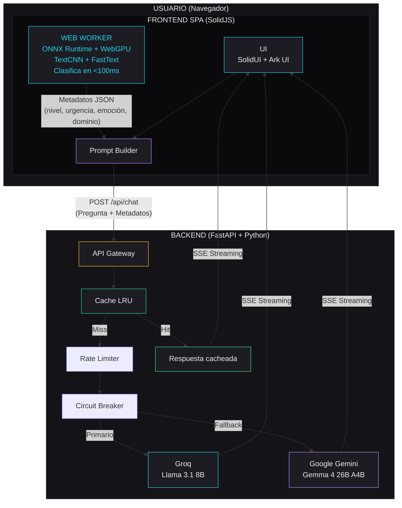

# Arquitectura General — Synapse

## Diagrama de Alto Nivel

## Componentes Principales

### 1. Frontend SPA (SolidJS + Vite)

- **Responsabilidad:** Interfaz de usuario, clasificación local, renderizado de streaming
- **Comunicación:** POST /api/chat al backend, SSE para recibir respuesta
- **Web Worker:** Ejecuta ONNX Runtime Web con WebGPU, no bloquea el hilo principal

### 2. Clasificador ONNX (Web Worker)

- **Responsabilidad:** Clasificar la pregunta en 4 dimensiones
- **Modelo:** TextCNN propia entrenada desde cero sobre embeddings FastText (español), exportada a ONNX
- **Formato:** ONNX (FP32; cuantización INT8 opcional), optimizado para WebGPU
- **Fallback:** WASM si WebGPU no disponible (latencia <400ms)

### 3. Backend API Gateway (FastAPI)

- **Responsabilidad:** Proxy seguro hacia LLMs, enriquecimiento de prompt, caché, rate limiting
- **Endpoints:** POST /api/chat (principal), GET /health (keep-alive)
- **Streaming:** SSE nativo via EventSourceResponse

### 4. Proveedores LLM

- **Primario:** Groq (Llama 3.1 8B Instant) — ~560 tps, $0.05-0.08/1M tokens
- **Fallback:** Google Gemini (Gemma 4 26B A4B) — nativo 140+ idiomas, razonamiento superior
- **Circuit Breaker:** 3 fallos → switch a fallback por 30s

## Flujo de Datos (Happy Path)

1. Usuario escribe: "No entiendo nada de recursividad"
2. Frontend envía texto al Web Worker (postMessage)
3. Web Worker ejecuta ONNX Runtime Web + WebGPU
4. Clasificación: `{nivel_tecnico: "principiante", urgencia: "alta", emocion: "frustracion", dominio: "backend"}`
5. Frontend envía POST /api/chat con `{pregunta, metadata}`
6. Backend chequea caché LRU → miss
7. Backend construye prompt enriquecido:
   > "Eres un tutor de programación experto en algoritmos. El estudiante es PRINCIPIANTE, está FRUSTRADO y necesita ayuda URGENTE. Explica desde cero, con empatía, usando ejemplos simples en Python. Pregunta: No entiendo nada de recursividad"
8. Backend envía prompt a Groq
9. Groq genera respuesta token por token (~560 tps)
10. Backend transmite tokens via SSE al frontend
11. Frontend renderiza cada token progresivamente con Markdown + syntax highlighting
12. Usuario lee respuesta personalizada

## Stack Tecnológico

| Capa | Tecnología | Justificación |
|------|------------|---------------|
| Frontend | SolidJS + TypeScript | Mejor performance con WebGPU, 7.6KB bundle, signals granulares |
| Build | Vite 6 | Nativo SolidJS, HMR instantáneo, Rolldown para prod |
| UI | SolidUI + Ark UI + Tailwind CSS v4 | Componentes accesibles, headless + styled, diseño rápido |
| Router | @solidjs/router | SPA sin SSR, createAsync + query para data fetching |
| ML Browser | ONNX Runtime Web + WebGPU | Inferencia local <100ms, sin enviar datos al servidor |
| Backend | FastAPI + Python 3.12 | SSE nativo, Pydantic AI, ecosistema LLM dominante |
| LLM SDK | Pydantic AI | Multi-provider, agentes, tipado fuerte |
| LLM Primario | Groq (Llama 3.1 8B) | 560 tps, $0.08/1M output, plan gratuito |
| LLM Fallback | Google Gemini (Gemma 4) | 140+ idiomas, razonamiento superior |
| Deploy FE | Cloudflare Pages | Ilimitado bandwidth, 300+ edge, gratis |
| Deploy BE | Render | Web Service Python, 750h/mes gratis |
| CI/CD | GitHub Actions | 2000 min/mes gratis |
| Testing | Vitest + Playwright + Storybook | Nativo Vite, multi-browser, componentes aislados |
| Linting | Biome + lefthook | Rust-fast, formateo + linting unificado |
| Package Manager | pnpm | Rápido, eficiente en disco, monorepo-friendly |
