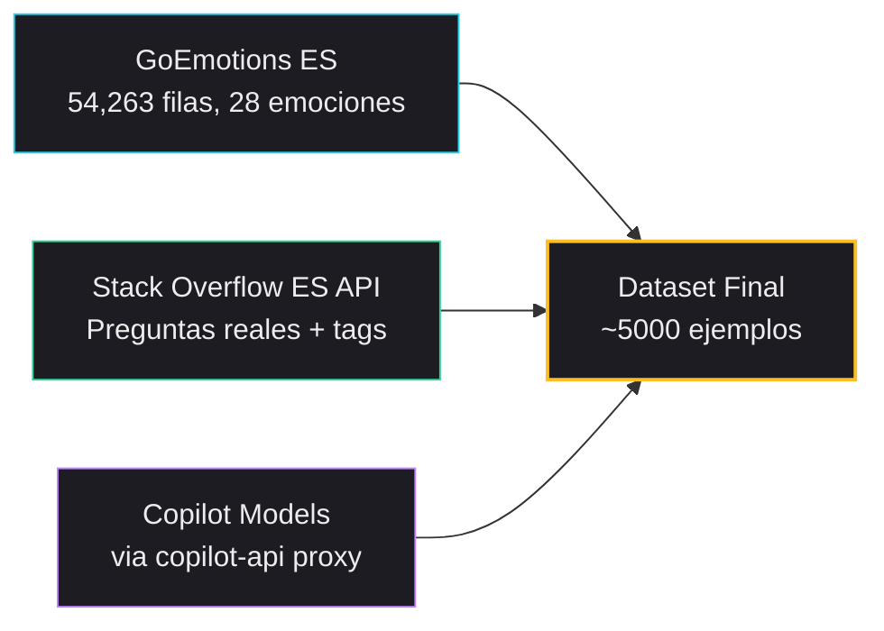
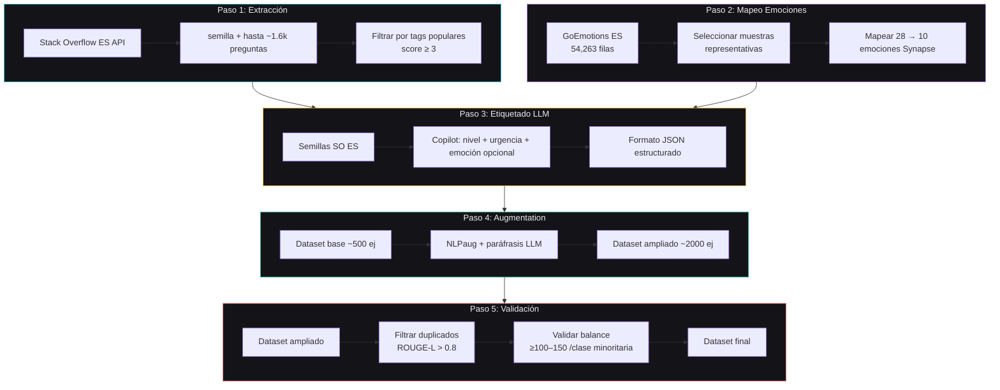
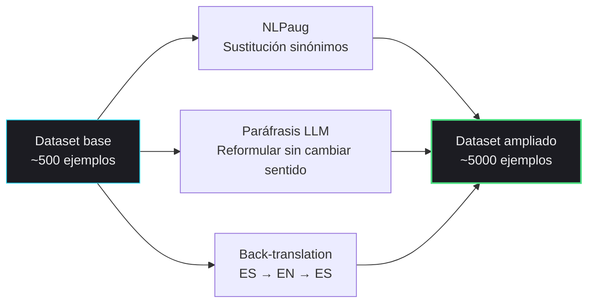

# Dataset — Plan de Generación Híbrida

## 1. Decisión: GoEmotions ES + Stack Overflow API + LLM

Estrategia híbrida que combina un dataset real de emociones en español con preguntas reales de programación y generación asistida por LLM para las dimensiones faltantes.




## 2. Fuentes de Datos

### 2.1 GoEmotions ES (Emociones)


| Propiedad | Valor                                               |
| --------- | --------------------------------------------------- |
| Dataset   | `AnasAlokla/multilingual_go_emotions` (HuggingFace) |
| Filas ES  | 54,263                                              |
| Emociones | 28 clases (multi-label)                             |
| Idioma    | Español (filtrado por language="sp")                |
| Metadata  | text, labels (IDs), id, language                    |
| Licencia  | Apache 2.0                                          |


**Mapeo de emociones (28 → 10):**


| Emociones GoEmotions ES                                | Emoción Synapse |
| ------------------------------------------------------ | --------------- |
| anger, annoyance, disapproval                          | `frustracion`   |
| confusion                                              | `confusion`     |
| curiosity, interest                                    | `curiosidad`    |
| desire                                                 | `curiosidad`    |
| nervousness, fear                                      | `ansiedad`      |
| admiration, excitement, joy, love, optimism, gratitude | `motivacion`    |
| approval, pride                                        | `confiado`      |
| realization, surprise                                  | `abrumado`      |
| sadness, disappointment, grief, remorse                | `desesperado`   |
| neutral, caring                                        | `neutral`       |


### 2.2 Stack Overflow ES API (Preguntas Reales)


| Propiedad       | Valor                                                                                                             |
| --------------- | ----------------------------------------------------------------------------------------------------------------- |
| API             | `api.stackexchange.com/2.3/questions?site=es.stackoverflow`                                                       |
| Filtros         | tags: python, javascript, java, react, sql, css, html, node.js, typescript, git                                   |
| Selección       | Semilla desde `so_questions.json` existente + cuotas por dominio + relleno hasta `--max-questions` (default 1600) |
| Volumen         | ~1.6k preguntas semilla (API budget `--max-api-calls`, default 960)                                               |
| Datos extraídos | title, body (sin respuestas), tags, score, view_count                                                             |


**Mapeo de tags → Dominio Synapse:**


| Tags de Stack Overflow                                      | Dominio Synapse       |
| ----------------------------------------------------------- | --------------------- |
| python, javascript, java, go, rust, php, ruby               | `backend`             |
| react, vue, css, html, angular, svelte, nextjs              | `frontend`            |
| sql, mysql, postgresql, mongodb, redis                      | `bases_de_datos`      |
| docker, kubernetes, aws, gcp, ci/cd, nginx                  | `devops`              |
| android, ios, flutter, react-native, swift, kotlin          | `movil`               |
| pandas, numpy, scikit-learn, tensorflow, pytorch            | `data_science`        |
| sorting, algorithms, data-structures, recursion             | `algoritmos`          |
| security, authentication, encryption, oauth, jwt, xss, csrf | `seguridad`           |
| os, memory, concurrency, threads, process, linux, bash      | `sistemas`            |
| design-patterns, testing, architecture, solid, tdd, junit   | `ingenieria_software` |
| Otros                                                       | `general`             |


### 2.3 Fuentes complementarias (emoción y afín en español)

Útiles para **aumentar cobertura emocional** y robustez fuera del estilo Reddit/GoEmotions, o para **pre-entrenar / regularizar** antes del dataset mezclado con programación. 


| Dataset                                  | Enlace                                                                                                                       | Por qué aplica                                                                   |
| ---------------------------------------- | ---------------------------------------------------------------------------------------------------------------------------- | -------------------------------------------------------------------------------- |
| **GoEmotions multilingüe** (base actual) | [AnasAlokla/multilingual_go_emotions](https://huggingface.co/datasets/AnasAlokla/multilingual_go_emotions)                   | Gran volumen ES; multi-label fino → útil tras mapeo                              |
| **EmoEvent** (ES)                        | [fmplaza/EmoEvent](https://huggingface.co/datasets/fmplaza/EmoEvent) (subconjunto español; puede requerir aceptación en Hub) | Tweets en español con emociones Ekman + ofensivo/no; útil para tono informal     |
| **SemEval-2018 Task 1** (E-c, ES)        | [SemEvalWorkshop/sem_eval_2018_task_1](https://huggingface.co/datasets/SemEvalWorkshop/sem_eval_2018_task_1)                 | Emoción multi-label en tweets ES; etiquetas distintas → requiere mapeo cuidadoso |
| **Preguntas técnicas ES**                | API/site `es.stackoverflow` + dump oficial SE                                                                                | Dominio “programación en español” nativo; ya integrado en el pipeline            |


### 2.4 Copilot (Etiquetado de Dimensiones Faltantes)

Usamos Copilot via proxy OpenAI-compatible y rotamos modelos disponibles:


| Modelo         | Fuente  | Uso principal         |
| -------------- | ------- | --------------------- |
| **gpt-5-mini** | Copilot | Etiquetado principal  |
| **gpt-4.1**    | Copilot | Etiquetado secundario |
| **gpt-4o**     | Copilot | Respaldo de rotación  |


**Estrategia de distribución:**

- Rotación round-robin entre modelos configurados (`--models`)
- Validación dinámica de IDs contra `GET /v1/models`
- Reanudación incremental sobre `processed/labeled.json`

**Tiempo Copilot:** depende del volumen (`--max-examples`), modelos y retardo entre peticiones; el flujo es incremental en `labeled.json` (véase §3.0).

## 3. Pipeline de Generación

### 3.0 Orden operativo

1. **GoEmotions** (si falta `raw/goemotions_es.json`): `python dataset/scripts/download_goemotions.py`
2. **Mapeo 28 → Synapse:** `python dataset/scripts/map_emotions.py` — `approval` y `pride` → `confiado` (no `motivacion`).
3. **Extracción SO:** `python dataset/scripts/extract_so.py` — semilla desde `so_questions.json` existente por defecto (`--seed-existing`); revisar `dataset/raw/extraction_audit.json`.
4. **Etiquetado Copilot:** `label_with_copilot.py` (`--list-models`, etiquetado con resume, `--label-emotion` para nuevas filas, `--emotion-backfill-only` para huecos); fallos en `dataset/processed/labeling_audit/copilot_failures.jsonl`.
5. **Dataset final:** `python dataset/scripts/build_final_dataset.py --target-rows 5000 --seed 42` — por defecto modo pragmático; `--no-pragmatic-supervised-dataset` restaura el modo honesto. Salidas en `dataset/final/` (`quality_report.json`, `dataset_quality_gates.json`, splits salvo `--no-split`).

### 3.1 Rebalanceo agresivo (colas SO + gates estrictos)

- **Métricas y lectura de artefactos:** `[dataset-rebalance-metrics.md](./dataset-rebalance-metrics.md)`.
- **Extracción SO** con más señal hacia dominios débiles y búsquedas advanced/low-urgency:
`python dataset/scripts/extract_so.py --rebalance-profile aggressive` (sube tope de términos salvo que los pases explícito; revisa `max_api_calls`).
- **Build final** con gates duros (falla con código distinto de 0 si no cumple):
`python dataset/scripts/build_final_dataset.py --target-rows 5000 --seed 42 --strict-rebalance-gates`
- **Sin augmentación** de sufijos SO: `--no-augment-so`.
- **Calibración Copilot** tras el etiquetado principal (sube colas `avanzado` / `alta` / opcional `baja`):
`python dataset/scripts/label_with_copilot.py --calibration-pass --target-min-avanzado … --target-min-alta … --target-min-baja …`

**Precedencia emoción SO en `labeled.json`:** si `emocion` ∈ taxonomía Synapse → se considera curada/LLM según flujo; si no, heurística `infer_emocion_so` en build. Metadato `emocion_source_so`: `llm_or_curated` `heuristic`.




### Paso 1: Extracción de Semillas (Stack Overflow ES)

```python
# Ejemplo de llamada a la API
import requests

url = "https://api.stackexchange.com/2.3/questions"
params = {
    "order": "desc",
    "sort": "votes",
    "site": "es.stackoverflow",
    "pagesize": 100,
    "tagged": "python",
    "filter": "withbody"
}
response = requests.get(url, params=params)
questions = response.json()["items"]
```

### Paso 2: Mapeo de Emociones (GoEmotions ES → Synapse)

```python
# Mapeo de las 28 emociones de GoEmotions hacia la taxonomía Synapse (10 emociones)
EMOTION_MAPPING = {
    # frustracion
    "anger": "frustracion",
    "annoyance": "frustracion",
    "disapproval": "frustracion",
    # confusion
    "confusion": "confusion",
    # curiosidad
    "curiosity": "curiosidad",
    "interest": "curiosidad",
    # ansiedad
    "nervousness": "ansiedad",
    "fear": "ansiedad",
    # motivacion
    "admiration": "motivacion",
    "approval": "motivacion",
    "excitement": "motivacion",
    "joy": "motivacion",
    "love": "motivacion",
    "optimism": "motivacion",
    "pride": "motivacion",
    "gratitude": "motivacion",
    "desire": "motivacion",
    # abrumado
    "surprise": "abrumado",
    "realization": "abrumado",
    # desesperado
    "sadness": "desesperado",
    "disappointment": "desesperado",
    "grief": "desesperado",
    "remorse": "desesperado",
    "embarrassment": "desesperado",
    # neutral
    "neutral": "neutral",
    "caring": "neutral",
}
```

### Paso 3: Etiquetado con LLM

```python
PROMPT_TEMPLATE = """
Eres un etiquetador de datos para un clasificador de emociones en programación.

Dada esta pregunta de programación en español:
"{texto}"

Y estas emociones candidatas: {emociones_candidatas}

Determina:
1. La emoción principal (de la lista proporcionada)
2. El nivel técnico del autor (principiante/intermedio/avanzado)
3. La urgencia de la consulta (baja/media/alta)

Responde en JSON:
{{
  "emocion": "...",
  "nivel_tecnico": "...",
  "urgencia": "...",
  "justificacion": "..."
}}
"""
```

### Paso 4: Data Augmentation




### Paso 5: Filtrado y Validación

- Eliminar duplicados (similitud ROUGE-L > 0.8)
- Validar clases minoritarias: **≥2000** ejemplos (ideal **≥2500**); ampliar dataset hacia **10k - 12k** ejemplos cuando sea posible

## 4. Distribución de Clases Objetivo


| Dimensión     | Etiquetas                              | Ejemplos por clase | Total |
| ------------- | -------------------------------------- | ------------------ | ----- |
| Nivel técnico | 3 (principiante, intermedio, avanzado) | ~2000              | 10000 |
| Urgencia      | 3 (baja, media, alta)                  | ~2000              | 10000 |
| Emoción       | 10                                     | ~850               | 10000 |
| Dominio       | 11                                     | ~900               | 10000 |


## 5. Formato del Dataset

```json
[
  {
    "texto": "No entiendo nada de recursividad, llevo horas intentándolo",
    "nivel_tecnico": "principiante",
    "urgencia": "alta",
    "emocion": "frustracion",
    "dominio": "algoritmos",
    "fuente": "so_es",
    "emocion_original_goemotions": "annoyance"
  },
  {
    "texto": "¿Cómo funciona el event loop de JavaScript a nivel interno?",
    "nivel_tecnico": "avanzado",
    "urgencia": "baja",
    "emocion": "curiosidad",
    "dominio": "frontend",
    "fuente": "so_es",
    "emocion_original_goemotions": "curiosity"
  }
]
```

## 6. Herramientas


| Herramienta                  | Uso                                              | Fuente                                                                             |
| ---------------------------- | ------------------------------------------------ | ---------------------------------------------------------------------------------- |
| Stack Exchange API           | Extraer preguntas semilla                        | `api.stackexchange.com`                                                            |
| GoEmotions ES (AnasAlokla)   | Dataset de emociones en español                  | [HuggingFace](https://huggingface.co/datasets/AnasAlokla/multilingual_go_emotions) |
| GitHub Copilot + copilot-api | Etiquetado (urgencia + nivel + emoción opcional) | `npx copilot-api@latest start --port 4141`                                         |
| `STACKEXCHANGE_KEY`          | Cuota API Stack Exchange (stackapps.com)         | Variable en entorno o `.env` leída por `extract_so.py` / scripts                   |
| NLPaug                       | Data augmentation                                | `pip install nlpaug`                                                               |
| ROUGE-L                      | Filtrado de duplicados                           | `pip install rouge-score`                                                          |
| Python + pandas              | Procesamiento y limpieza                         | -                                                                                  |


## 7. Entregables

```
dataset/
├── processed/
│   ├── goemotions_mapped.json     # Mapeo GoEmotions 28 → Synapse
│   └── labeling_audit/            # Fallos Copilot (p. ej. copilot_failures.jsonl)
│   └── labeled.json               # Con etiquetas del LLM
├── final/
│   ├── dataset.json               # Dataset final entrenable (F4: build_final_dataset)
│   ├── quality_report.json        # Conteos por dimensión y fuente
│   ├── train.json                 # 70% entrenamiento
│   ├── val.json                   # 15% validación
│   ├── test.json                  # 15% prueba
│   └── split_meta.json            # Metadatos del split
├── artifacts/                     # Generado: vocab.json, embedding_init.pt
├── checkpoints/                   # Generado: best.pt por corrida de entrenamiento
├── scripts/
│   ├── download_goemotions.py
│   ├── map_emotions.py
│   ├── extract_so.py
│   ├── label_with_copilot.py
│   ├── build_final_dataset.py    # Fusiona SO+GoE, meta ~4k–6k, dedup, split
│   ├── split_dataset.py           # Train/val/test reproducible (también desde build_final_dataset)
│   └── backup/
└── README.md

neural_network/                      # TextCNN + cuaderno (implementación única)
├── notebook/
│   ├── synapse_textcnn_training.ipynb
│   └── data/                        # train/val/test para Colab (opcional en repo)
└── scripts/
    ├── build_vocab.py
    ├── train_textcnn.py
    ├── textcnn_model.py             # Definición SynapseTextCNN
    ├── training_labels.py           # Orden de clases por cabeza
    └── export_onnx.py
```

Flujo de **regeneración de datos**: §3.0 de este documento. **Entrenamiento** (épocas, DoD, cuaderno): `runbook.md` y `fine-tuning-process.md` (§6).

## 8. Cronograma


| Día | Tarea                                               | Entregable                                                     |
| --- | --------------------------------------------------- | -------------------------------------------------------------- |
| 1   | Extraer preguntas SO ES + descargar GoEmotions ES   | `raw/`                                                         |
| 1   | Mapear emociones GoEmotions → Synapse               | `processed/goemotions_mapped.json`                             |
| 2   | Etiquetar con LLM (urgencia + nivel)                | `processed/labeled.json`                                       |
| 2-3 | Fusionar y escalar (~4k–6k), dedup, balance emoción | `final/dataset.json`, `quality_report.json`                    |
| 3   | Split reproducible (integrado o `split_dataset.py`) | `final/train.json`, `val.json`, `test.json`, `split_meta.json` |


**Tiempo total: 3 días** (dentro de las 2 semanas)

## 9. Justificación Académica

### Por qué esta estrategia

1. **GoEmotions Multilingual** es un dataset académico validado (Google Research, 2020) con traducciones a múltiples idiomas incluyendo español
2. **Stack Overflow ES** proporciona preguntas de programación reales en español
3. **Etiquetado con LLM** es una práctica validada por el paper *"Synthetic Data Generation with LLMs for Text Classification"* (arXiv:2310.07849)
4. **Data augmentation** con NLPaug está respaldado por múltiples papers de NLP

### Ventajas sobre 100% sintético

- Emociones de un dataset real, no inventadas
- Preguntas de programación reales de desarrolladores hispanohablantes
- Más defensible en la sustentación académica
- Mejor generalización del modelo

### Referencias

- GoEmotions: *"A Dataset for Fine-Grained Emotion Classification"* (Demszky et al., 2020)
- GoEmotions Multilingual: [AnasAlokla/multilingual_go_emotions](https://huggingface.co/datasets/AnasAlokla/multilingual_go_emotions)
- EmoEvent: [fmplaza/EmoEvent](https://huggingface.co/datasets/fmplaza/EmoEvent) (Plaza-del-Arco et al., LREC 2020)
- SemEval-2018 Task 1: [SemEvalWorkshop/sem_eval_2018_task_1](https://huggingface.co/datasets/SemEvalWorkshop/sem_eval_2018_task_1) (Mohammad et al., 2018)
- Stack Overflow API: Documentación oficial de Stack Exchange
- Synthetic Data: *"Synthetic Data Generation with LLMs for Text Classification"* (arXiv:2310.07849)

