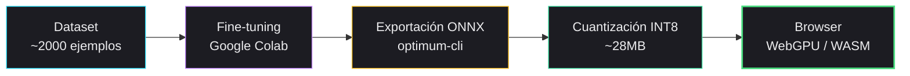
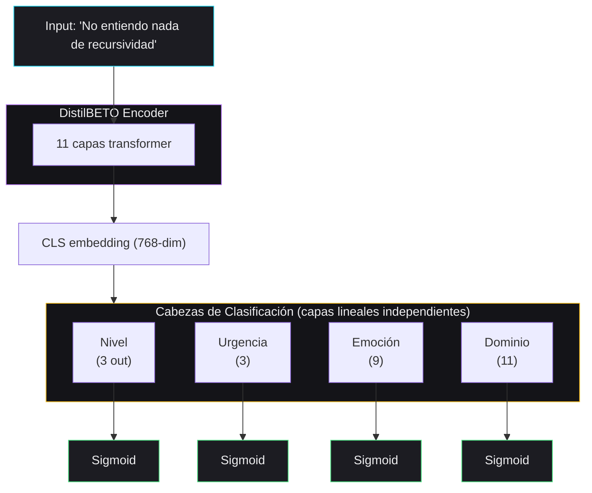

# Fine-tuning — Entrenamiento de la Red Neuronal

## 1. Resumen

Proceso completo para entrenar DistilBETO (BERT en español) como clasificador multi-etiqueta de 4 dimensiones y exportarlo a ONNX para ejecución en el navegador.



## 2. Modelo Base

| Propiedad         | Valor                                                      |
| ----------------- | ---------------------------------------------------------- |
| Modelo            | `dccuchile/distilbert-base-spanish-wwm-cased` (DistilBETO) |
| Arquitectura      | DistilBERT (versión destilada de BETO)                     |
| Parámetros        | 67M en 11 capas                                            |
| Vocabulario       | 31,002 tokens (español)                                    |
| Tamaño original   | ~260MB (FP32)                                              |
| Tamaño cuantizado | ~28MB (INT8)                                               |

## 3. Arquitectura del Clasificador



**Total nodos de salida:** 3 + 3 + 9 + 11 = **26**

## 4. Preparación de Datos

### Formato de entrada

```python
# Cada ejemplo del dataset se tokeniza así:
tokenizer = AutoTokenizer.from_pretrained("dccuchile/distilbert-base-spanish-wwm-cased")

inputs = tokenizer(
    "No entiendo nada de recursividad",
    padding="max_length",
    max_length=128,
    truncation=True,
    return_tensors="pt"
)
```

### Formato de etiquetas (multi-hot encoding)

```python
# Las etiquetas son floats (no ints) en formato binario:
labels = {
    "nivel": [1.0, 0.0, 0.0],           # principiante
    "urgencia": [0.0, 0.0, 1.0],         # alta
    "emocion": [1.0, 0.0, 0.0, 0.0, 0.0, 0.0, 0.0, 0.0, 0.0],  # frustracion
    "dominio": [0.0, 0.0, 1.0, 0.0, 0.0, 0.0, 0.0, 0.0, 0.0, 0.0, 0.0]  # algoritmos
}

# Concatenado para el modelo:
labels_tensor = torch.tensor(
    labels["nivel"] + labels["urgencia"] + labels["emocion"] + labels["dominio"],
    dtype=torch.float32
)
# Shape: [26]
```

## 5. Configuración del Entrenamiento

```python
from transformers import AutoModelForSequenceClassification, TrainingArguments, Trainer

model = AutoModelForSequenceClassification.from_pretrained(
    "dccuchile/distilbert-base-spanish-wwm-cased",
    num_labels=26,
    problem_type="multi_label_classification"  # Activa BCEWithLogitsLoss
)

training_args = TrainingArguments(
    output_dir="./distilbeto-synapse",
    num_train_epochs=5,
    per_device_train_batch_size=16,
    per_device_eval_batch_size=32,
    learning_rate=2e-5,
    weight_decay=0.01,
    eval_strategy="epoch",
    save_strategy="epoch",
    load_best_model_at_end=True,
    metric_for_best_model="f1_macro",
    fp16=True,  # Mixed precision para ahorrar VRAM
    report_to="none"  # Sin W&B
)

trainer = Trainer(
    model=model,
    args=training_args,
    train_dataset=train_dataset,
    eval_dataset=eval_dataset,
    compute_metrics=compute_metrics,
)
```

### Función de pérdida

`BCEWithLogitsLoss` — Binary Cross Entropy con Logits. Combina Sigmoid + BCE en una sola operación, más estable numéricamente que aplicar Sigmoid separadamente.

```python
# Se activa automáticamente con problem_type="multi_label_classification"
# No necesita configuración manual
```

### Métricas

```python
from sklearn.metrics import f1_score, precision_score, recall_score

def compute_metrics(pred):
    logits = pred.predictions
    labels = pred.label_ids

    # Aplicar sigmoid y umbral 0.5
    probs = 1 / (1 + np.exp(-logits))
    preds = (probs >= 0.5).astype(int)

    return {
        "f1_macro": f1_score(labels, preds, average="macro"),
        "f1_micro": f1_score(labels, preds, average="micro"),
        "precision": precision_score(labels, preds, average="macro"),
        "recall": recall_score(labels, preds, average="macro"),
    }
```

## 6. Entrenamiento

### Entorno

| Recurso         | Especificación                           |
| --------------- | ---------------------------------------- |
| Plataforma      | Google Colab (gratis)                    |
| GPU             | T4 (16GB VRAM)                           |
| RAM             | 12GB                                     |
| Tiempo estimado | 30-60 minutos (2000 ejemplos, 30 epochs) |

### Comandos

```bash
# 1. Instalar dependencias
pip install transformers datasets evaluate accelerate scikit-learn

# 2. Subir dataset a Colab
# (desde Google Drive o upload directo)

# 3. Ejecutar entrenamiento
python train.py
```

## 7. Exportación a ONNX

### Con 🤗 Optimum

```bash
# Instalar
pip install optimum[onnxruntime]

# Exportar
optimum-cli export onnx \
  --model ./distilbeto-synapse/best-checkpoint \
  --task text-classification \
  --optimize O2 \
  ./distilbeto-onnx/
```

### Cuantización INT8

```python
from optimum.onnxruntime import ORTQuantizer, ORTModelForSequenceClassification

model = ORTModelForSequenceClassification.from_pretrained("./distilbeto-onnx/")
quantizer = ORTQuantizer.from_pretrained(model)

quantizer.quantize(
    save_dir="./distilbeto-onnx-int8/",
    quantization_config=QuantizationConfig(
        operators_to_quantize=["MatMul", "Add"]
    )
)
```

### Resultado

| Archivo                | Tamaño | Uso                            |
| ---------------------- | ------ | ------------------------------ |
| `model.onnx`           | ~260MB | Original FP32                  |
| `model_quantized.onnx` | ~28MB  | INT8 cuantizado (para browser) |
| `tokenizer.json`       | ~15MB  | Tokenizer                      |

## 8. Ejecución en el Navegador

### Opción A: ONNX Runtime Web (recomendada)

```javascript
import * as ort from "onnxruntime-web/webgpu";

const session = await ort.InferenceSession.create("./model_quantized.onnx", {
  executionProviders: ["webgpu"], // Fallback automático a WASM
});

// Tokenizar y ejecutar
const inputIds = new ort.Tensor("int32", tokenIds, [1, 128]);
const attentionMask = new ort.Tensor("int32", mask, [1, 128]);
const results = await session.run({
  input_ids: inputIds,
  attention_mask: attentionMask,
});

// Aplicar sigmoid y umbral
const logits = results.logits.data;
const probs = logits.map((v) => 1 / (1 + Math.exp(-v)));
const predictions = probs.map((p) => p >= 0.5);
```

### Opción B: Transformers.js

```javascript
import { pipeline } from "@huggingface/transformers";

const classifier = await pipeline("text-classification", "./distilbeto-onnx/", {
  device: "webgpu",
  dtype: "q4f16",
});

const result = await classifier("No entiendo nada de recursividad");
```

### Requisitos del Servidor

```json
// Cloudflare Pages _headers
/*
  Cross-Origin-Opener-Policy: same-origin
  Cross-Origin-Embedder-Policy: require-corp
```

Estas cabeceras son obligatorias para `SharedArrayBuffer` (necesario para WebGPU multi-threading).

## 9. Fallback: WASM

Si WebGPU no está disponible (Safari, Firefox sin flag), ONNX Runtime fallback a WASM automáticamente:

```javascript
const session = await ort.InferenceSession.create("./model_quantized.onnx", {
  executionProviders: ["webgpu", "wasm"], // Intenta WebGPU, fallback a WASM
});
```

| Backend | Latencia | Compatibilidad                     |
| ------- | -------- | ---------------------------------- |
| WebGPU  | <100ms   | Chrome 113+, Edge 113+, Safari 18+ |
| WASM    | <400ms   | Todos los navegadores modernos     |

## 10. Referencias

- Hugging Face Multi-Label Tutorial: [Blog](https://huggingface.co/blog/Valerii-Knowledgator/multi-label-classification)
- Export to ONNX: [Optimum Docs](https://huggingface.co/docs/optimum-onnx/onnx/usage_guides/export_a_model)
- ONNX Runtime Web + WebGPU: [Tutorials](https://onnxruntime.ai/docs/tutorials/web/ep-webgpu.html)
