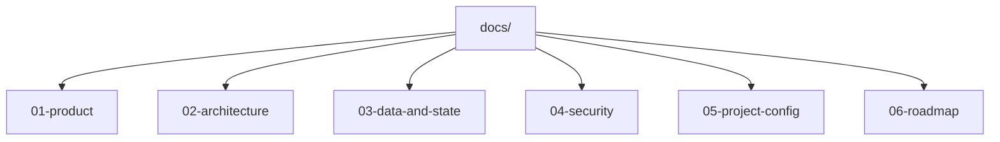

# Documentación — Synapse

Este README organiza la carpeta `docs/` y define dónde se mantiene cada tipo de decisión del proyecto.

## Objetivo

- Centralizar requisitos, arquitectura, datos, seguridad y roadmap.
- Evitar que el estado del proyecto se disperse entre múltiples documentos.
- Facilitar auditorías por fase con trazabilidad clara.

## Mapa de la Carpeta

## Índice y Uso

| Carpeta              | Enfoque                                       | Documentos clave                                                            |
| -------------------- | --------------------------------------------- | --------------------------------------------------------------------------- |
| `01-product/`        | Qué se construye y para quién                 | `requirements.md`, `ux-decisions.md`, `prompt-templates.md`, `ui-design.md` |
| `02-architecture/`   | Cómo se implementa                            | `overview.md`, `api/contracts.md`, `adr/`                                   |
| `03-data-and-state/` | Pipeline de datos y estado de app/modelo      | `dataset-plan.md`, `fine-tuning-process.md` (TextCNN + DoD)                 |
| `04-security/`       | Controles de seguridad y secretos             | `security-model.md`                                                         |
| `05-project-config/` | Estructura esperada del repositorio           | `structure.md`                                                              |
| `06-roadmap/`        | Estado por fases, hitos y criterios de cierre | `roadmap.md`, `milestones.md`                                               |

## Ruta de Lectura Recomendada

1. `01-product/requirements.md`
2. `02-architecture/overview.md`
3. `02-architecture/api/contracts.md`
4. `03-data-and-state/dataset-plan.md`
5. `06-roadmap/roadmap.md`
